  

  
  
  
  

  <strong>AI product engineering · Multilingual UX · Cultural technology</strong>

## Hello — I’m Waris

I’m a designer and developer based in Japan, building practical AI-powered products and multilingual digital experiences. My work sits at the intersection of **engineering, product design, language, and culture**—with a special focus on thoughtful Uyghur-first experiences.

I care about products that feel clear, fast, human, and culturally aware.

<table>
  <tr>
    <td width="50%" valign="top">
      <h3>AI products</h3>
      
Useful assistants, search experiences, knowledge tools, and intelligent workflows designed around real user needs.

    </td>
    <td width="50%" valign="top">
      <h3>Multilingual platforms</h3>
      
Unicode-safe, RTL-aware interfaces with careful typography and culturally relevant product decisions.

    </td>
  </tr>
  <tr>
    <td width="50%" valign="top">
      <h3>Product engineering</h3>
      
Scalable web applications built with modern React, Next.js, TypeScript, APIs, and production-ready data systems.

    </td>
    <td width="50%" valign="top">
      <h3>Interface design</h3>
      
Premium, minimal systems with strong hierarchy, responsive interaction, accessibility, and clear user journeys.

    </td>
  </tr>
</table>

## Selected work

| Product | What it explores |
| --- | --- |
| [Uyghur Play & Learn](https://oyun.idirak.com/) | A kid-friendly Uyghur learning platform with vocabulary, stories, culture, and interactive games. |
| [Idirak](https://idirak.com/) | Digital products and cultural technology built for meaningful everyday use. |
| [AI Lab](https://ai.idirak.com/) | Applied AI tools, experiments, and product ideas. |
| [Idirak Search](https://search.idirak.com/) | A focused multilingual search experience. |

## Tools I enjoy working with

  
  
  
  
  
  
  
  
  
  
  
  

## What I’m focused on

- Building AI-native interfaces that remain simple and trustworthy
- Creating stronger Uyghur and multilingual digital experiences
- Designing reusable systems that scale from prototype to production
- Turning cultural context into a first-class product requirement
- Connecting thoughtful UX with reliable engineering

> **My favorite products do more than work well—they feel like they understand the people using them.**

  <strong>Open to thoughtful collaborations in AI, multilingual technology, education, and cultural products.</strong>

  <a href="https://warisruzi.com/">Portfolio</a>
  ·
  <a href="https://ai.idirak.com/">AI Lab</a>
  ·
  <a href="https://search.idirak.com/">Search</a>
  ·
  <a href="https://x.com/warisruzi">X</a>

