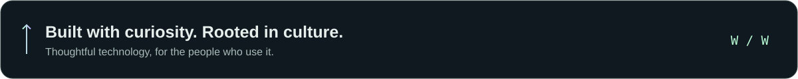

<!-- Profile artwork lives in assets/. Keep important information in text, too. -->

  

  <a href="https://warisruzi.com/"><strong>Portfolio ↗</strong></a> &nbsp; / &nbsp;
  <a href="https://ai.idirak.com/"><strong>AI Lab ↗</strong></a> &nbsp; / &nbsp;
  <a href="https://idirak.com/"><strong>Idirak ↗</strong></a> &nbsp; / &nbsp;
  <a href="https://x.com/warisruzi"><strong>Find me on X ↗</strong></a>

## Good software should feel like it understands you.

I’m **Waris**, a designer and developer based in **Japan**. I build AI-powered products and multilingual experiences, with a special focus on **Uyghur-first technology**.

I care about the whole journey: the idea, the interface, the code, and the small details that make a product feel human. Clear typography. Fast interactions. Language support that belongs there from day one.

**Currently exploring:** useful AI interfaces, multilingual search, and playful ways to learn.

 

## A few things I’m building

<table>
<tr>
<td width="50%" valign="top">
<h3>01 / AI Lab</h3>

<strong>A playground for useful intelligence.</strong>

Applied AI tools, experiments, and product ideas shaped around everyday needs.

<a href="https://ai.idirak.com/">Explore the lab ↗</a>

</td>
<td width="50%" valign="top">
<h3>02 / Uyghur Play &amp; Learn</h3>

<strong>Small games. Meaningful connections.</strong>

A kid-friendly world of Uyghur vocabulary, stories, culture, and interactive learning.

<a href="https://oyun.idirak.com/">Come play ↗</a>

</td>
</tr>
<tr>
<td width="50%" valign="top">
<h3>03 / Idirak Search</h3>

<strong>Discovery across languages.</strong>

A focused multilingual search experience, built with language and context in mind.

<a href="https://search.idirak.com/">Discover more ↗</a>

</td>
<td width="50%" valign="top">
<h3>04 / Idirak</h3>

<strong>Where code meets culture.</strong>

Digital products and cultural technology for meaningful everyday use.

<a href="https://idirak.com/">Step inside ↗</a>

</td>
</tr>
</table>

## My everyday toolkit

| Layer | Tools I enjoy |
| :--- | :--- |
| **Interfaces** | `TypeScript` · `React` · `Next.js` · `Tailwind CSS` |
| **Intelligence & APIs** | `Python` · `FastAPI` · `Node.js` · `OpenAI` |
| **Data & delivery** | `PostgreSQL` · `Supabase` · `Vercel` · `AWS` |
| **Design** | `Figma` · Design systems · Prototyping |

<strong>A little more about how I work</strong>

- **Language is part of the architecture.** Unicode, RTL layouts, and careful typography matter from the start.
- **Useful comes first.** AI should make the experience clearer and the work easier.
- **Design and engineering belong together.** The details on both sides shape how a product feels.
- **Culture is a product requirement.** The best tools respect the people and communities using them.

 

## Have something interesting in mind?

I’m open to collaborations in **AI, multilingual technology, education, and cultural products**.

[Explore my work](https://warisruzi.com/) · [Let’s connect on X](https://x.com/warisruzi)

  

